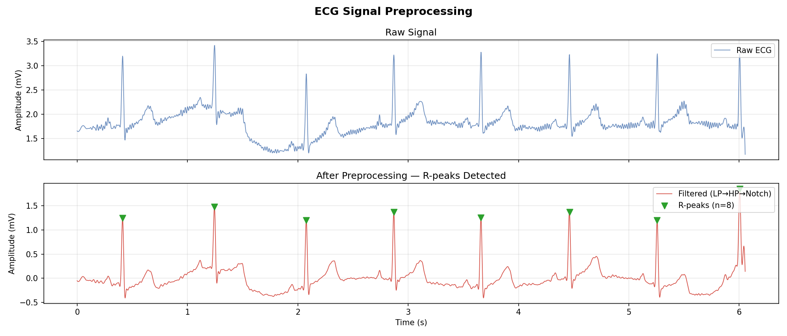
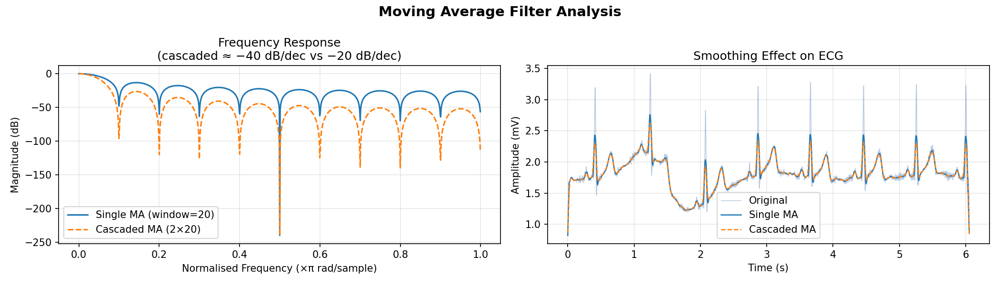
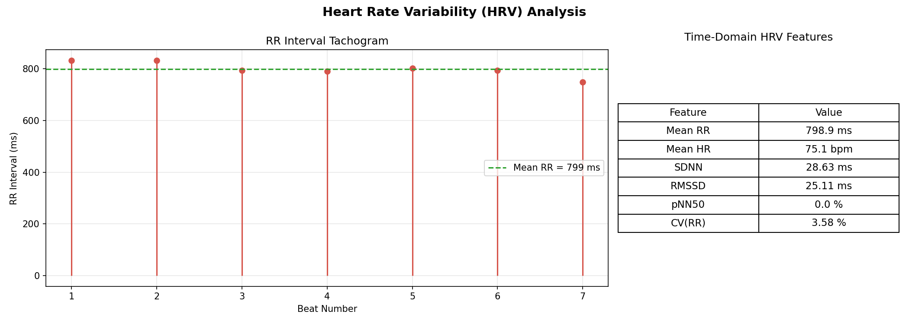
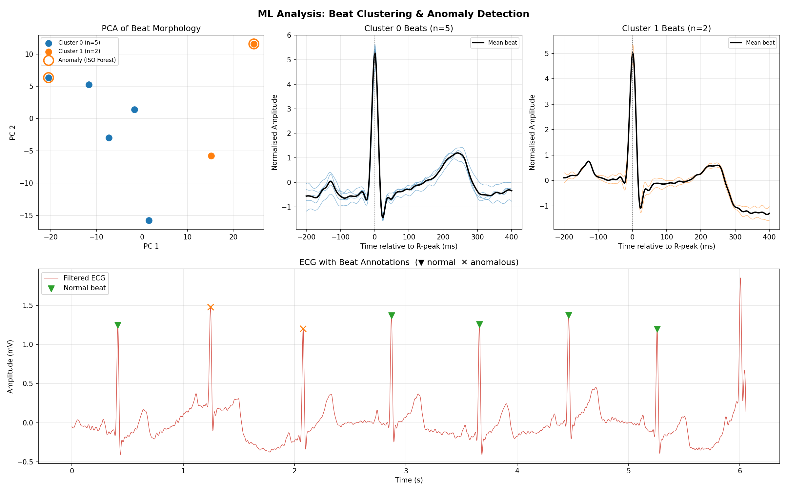

# ECG Signal Processing & ML Analysis

A clean, well-documented Python pipeline for ECG preprocessing, heart rate variability (HRV) analysis, and unsupervised beat classification — built from scratch using `scipy`, `numpy`, and `scikit-learn`.

---

## What This Does

| Stage | What | Why |
|---|---|---|
| **Filtering** | Butterworth LP → HP → Notch | Remove muscle noise, baseline wander, and 50 Hz powerline interference |
| **R-peak Detection** | Adaptive threshold + minimum distance | Locate heartbeats; foundation of all downstream analysis |
| **HRV Features** | SDNN, RMSSD, pNN50, CV(RR) | Clinically validated markers of autonomic nervous system health |
| **Beat Segmentation** | Fixed windows around each R-peak | Isolate individual beats as waveforms for ML |
| **PCA** | Dimensionality reduction on beat waveforms | Visualise morphological variation between beats |
| **K-Means Clustering** | Group beats by shape | Distinguish normal from ectopic beats |
| **Isolation Forest** | Anomaly scoring | Flag morphologically unusual beats without labels |

---

## Project Structure

```
ecg-signal-processing/
├── src/
│   ├── filters.py          # All digital filters (LP, HP, notch, MA, derivative)
│   ├── features.py         # R-peak detection, RR intervals, HRV features, beat segmentation
│   ├── ml_analysis.py      # PCA, K-Means, Isolation Forest
│   └── main.py             # End-to-end pipeline — run this
├── data/
│   └── ECG2.xlsx           # Single-lead ECG (500 Hz, ~6 seconds)
├── outputs/                # Generated plots land here
├── requirements.txt
└── README.md
```

---

## Outputs

**Figure 1 — Filtering Pipeline**

Raw ECG vs preprocessed signal with R-peaks detected.



**Figure 2 — Moving Average Analysis**

Frequency response and smoothing effect of single vs cascaded MA filters. Cascaded MA achieves ~−40 dB/decade rolloff vs ~−20 dB/decade for a single stage.



**Figure 3 — HRV Analysis**

RR interval tachogram with time-domain HRV feature table.



**Figure 4 — ML Analysis**

PCA scatter coloured by K-Means cluster, per-cluster beat overlays, and full ECG annotated with normal/anomalous beats.



---

## Key Signal Processing Concepts

### Why This Filter Order?

```
Raw → Low-pass (40 Hz) → High-pass (0.5 Hz) → Notch (50 Hz)
```

- **LP first** removes aliasing and high-frequency muscle artifacts before the HP sees the signal. Doing HP first lets those artifacts distort the baseline removal.
- **HP removes baseline wander** — slow drift from respiration and electrode movement (< 0.5 Hz).
- **Notch last** is the narrowest intervention and should operate on an already clean signal to avoid side-effects.
- **`filtfilt` throughout** — zero-phase filtering. Using `lfilter` would shift R-peak positions in time, corrupting HRV intervals.

### Why Cascade Moving Averages?

A single boxcar (MA) filter has a `sinc` frequency response — poor stopband attenuation (~−13 dB). Convolving two boxcars produces a triangular window with ~−26 dB stopband. For smoother baseline estimation this is better than increasing the window size of a single MA (which increases latency without improving the rolloff shape).

### HRV Features Explained

| Feature | Formula | Clinical meaning |
|---|---|---|
| SDNN | std(RR) | Overall HRV — autonomic modulation |
| RMSSD | √mean(ΔRR²) | Short-term vagal (parasympathetic) tone |
| pNN50 | % \|ΔRR\| > 50 ms | Vagal tone; < 3% suggests dysfunction |
| CV(RR) | SDNN / mean(RR) × 100 | Normalised HRV — comparable across heart rates |

### Why Unsupervised ML?

A 6-second recording yields ~8 beats — nowhere near enough for supervised classification. Instead:

- **PCA** reveals whether beats cluster or spread in morphology space.
- **K-Means** groups beats by waveform shape without needing labels.
- **Isolation Forest** scores each beat by how "easy" it is to isolate from the rest. Beats requiring fewer random partitions to isolate are outliers. This needs no labels and adapts to each patient's baseline.

In a production pipeline (e.g., MIT-BIH Arrhythmia Database), you'd train a supervised classifier (SVM, CNN, Transformer) on thousands of labelled beats. This project shows the correct data preparation: filter → detect → segment → normalise → extract features.

---

## Installation

```bash
git clone https://github.com/your-username/ecg-signal-processing.git
cd ecg-signal-processing
pip install -r requirements.txt
```

## Usage

```bash
cd src
python main.py                          # uses data/ECG2.xlsx by default
python main.py --data path/to/file.xlsx # custom data file
python main.py --no-save                # display plots without saving
```

---

## Requirements

```
numpy
pandas
scipy
matplotlib
scikit-learn
openpyxl
```

---

## Data

Single-lead ECG sampled at 500 Hz, approximately 6 seconds (3028 samples). One column is time (seconds), the other is amplitude (mV).

Sample results on this recording:
- Heart rate: **75.1 bpm**
- SDNN: **28.6 ms**
- RMSSD: **25.1 ms**
- 8 R-peaks detected, 7 beats segmented

---

## Limitations & Next Steps

- **Short recording**: 6 seconds is insufficient for frequency-domain HRV (needs 5 min). Results are for demonstration only.
- **Single lead**: Clinical ECG uses 12 leads. Multi-lead morphology adds ST-elevation and axis deviation features.
- **No ground truth**: The anomaly labels from Isolation Forest are unsupervised — clinical validation would require cardiologist annotation.
- **Next steps**: Extend to MIT-BIH dataset → train a supervised beat classifier → add frequency-domain HRV (LF/HF ratio).
